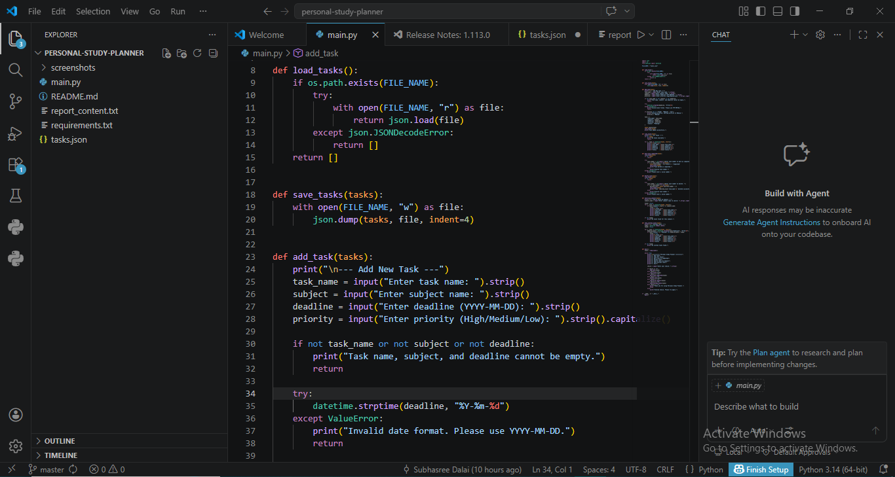
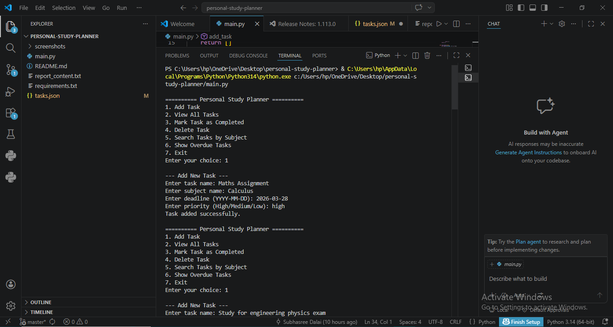
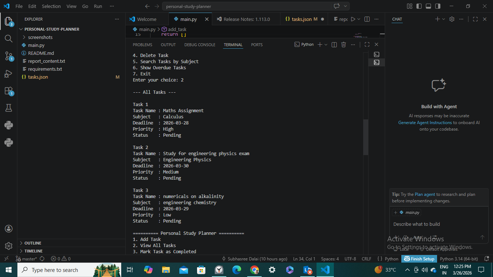
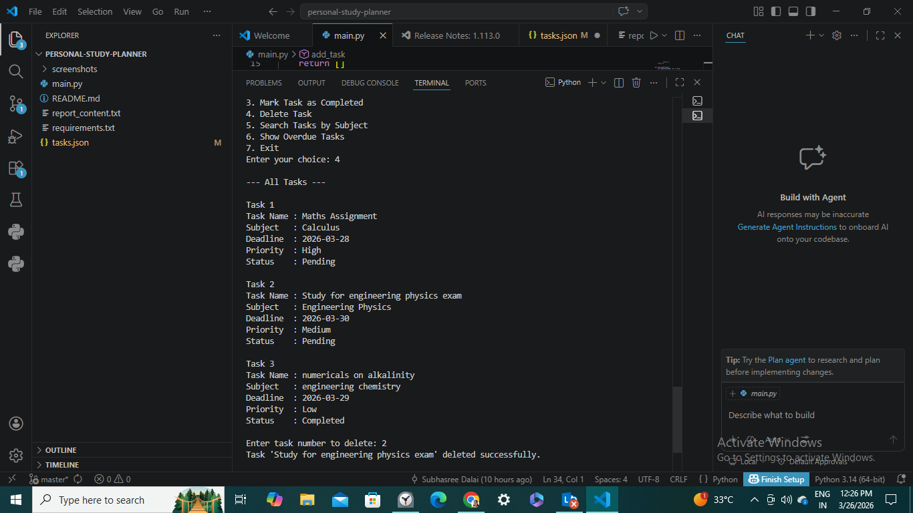
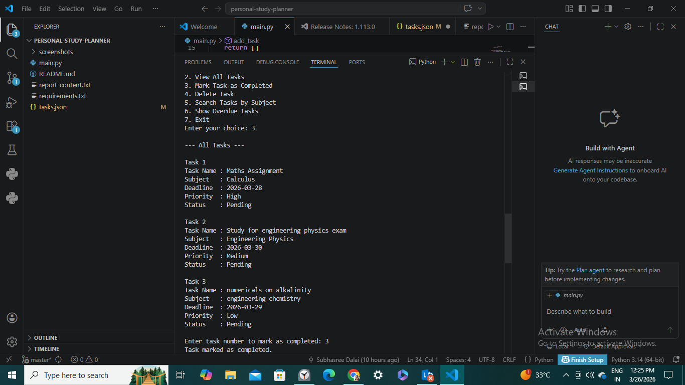

# 📚 Personal Study Planner

## 🧠 Overview
Personal Study Planner is a Python-based command-line application designed to help students manage their academic tasks efficiently. It allows users to add, view, update, and track study-related tasks with deadlines and priorities.

---

## ❗ Problem Statement
Students often struggle to organize assignments, revision schedules, and deadlines, leading to missed tasks and increased stress. This project aims to provide a simple solution for managing academic work effectively.

---

## 🎯 Objective
To build a menu-driven Python program that helps students:
- Organize study tasks
- Track deadlines
- Manage priorities
- Monitor task completion

---

## ✨ Features
-  Add new tasks
-  View all tasks
-  Mark task as completed
-  Delete task
-  Search tasks by subject
-  Show overdue tasks
-  Save tasks using JSON file

---

## 🛠️ Technologies Used
- Python 3
- JSON (file handling)
- VS Code / PyCharm
- GitHub

---

## 📁 Project Structure
personal-study-planner/
│
├── main.py
├── tasks.json
├── README.md
├── report_content.txt
└── requirements.txt

---

## 📸 Screenshots

### Main Menu

### Add Task

### Add Task

### Delete Task

### Completed Task

---

## 📚 Python Concepts Used
- Variables and data types
- Input/output
- Conditional statements
- Loops
- Functions
- Lists and dictionaries
- File handling (JSON)
- Date handling (datetime)

---

## 🚧 Challenges Faced
- Handling invalid user inputs
- Managing file operations
- Validating date formats
- Structuring code properly

---

## 🎓 Learning Outcomes
- Real-life problem solving using Python
- File handling using JSON
- Writing modular code
- Using GitHub for version control
- Writing documentation

---

## 🔮 Future Scope
- GUI using Tkinter
- Notification system
- Login system
- Mobile app version
- Calendar integration

---

## 👩‍💻 Author
Subhasree Dalai
25BEC10091
